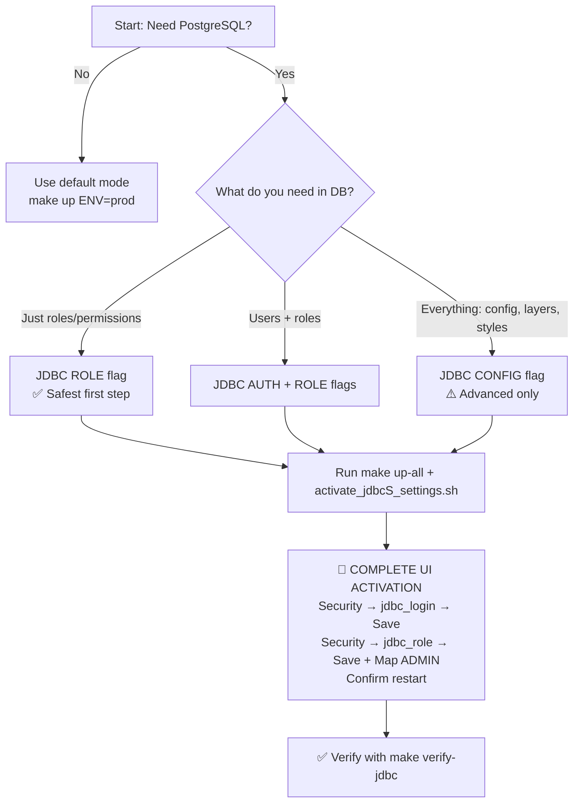

# GeoServer JDBC Setup – Critical User Guide

> 🚨 **READ THIS FIRST**  
> **Backend config alone is NOT enough.**  
> Even with perfect `.env` settings and `make up-all`, JDBC **will not work** until you complete the **mandatory UI activation steps** below.  
> This is a GeoServer limitation, not a bug in this setup.

---

## ⚠️ The One Thing You Cannot Skip

| Step | Command / Action | Why It's Mandatory |
|------|-----------------|-----------------|
| 1️⃣ Backend Config | `make up-all ENV=prod` | Starts GeoServer + PostgreSQL with JDBC flags |
| 2️⃣ Prep Script | `ENV_FILE=.env.prod ./scripts/activate_jdbcS_settings.sh` | Creates JDBC service definitions in GeoServer config |
| 3️⃣ UI Activation | Click through GeoServer Admin UI (detailed below) | **GeoServer requires manual confirmation to activate JDBC services** |
| 4️⃣ Restart | Press `y` when prompted | Reloads security chain with new JDBC providers |

> ❗ **If you skip Step 2 or 3, JDBC will silently fail.**  
> GeoServer will start, login will work, but roles/users will NOT be read from PostgreSQL. You will think it's broken, but you just missed the UI step.

---

## ⚡ Quick Start: Enable JDBC (Complete Flow)

### Phase 1: Backend Setup (Makefile)
```bash
# 1. Edit your .env.prod file
GEOSERVER_ENABLE_JDBC_ROLE=true
GEOSERVER_ENABLE_JDBC_AUTH=true
GEOSERVER_ENABLE_JDBC_CONFIG=false

# 2. Start GeoServer + PostgreSQL
make up-all ENV=prod

# 3. Wait for startup to complete (~30-60 seconds)
make logs-follow ENV=prod
# Look for: "GeoServer is ready" or similar

# 4. Run the prep script (creates service definitions)
ENV_FILE=.env.prod ./scripts/activate_jdbcS_settings.sh
```

✅ Backend is configured. **Now you MUST do the UI activation.**

---

### Phase 2: UI Activation (MANDATORY – Do Not Skip)

> 🔐 Open GeoServer Admin UI: https://your-domain.com/geoserver  
> 🔑 Login with your admin credentials

#### Step A: Activate JDBC Login Service
1. Navigate: **Security → User Group Services → jdbc_login**
2. Click tab: **Settings**
3. ⚠️ **UI Quirk**: If "Driver Class Name" appears empty:
   - Click tab: **Users**
   - Return to tab: **Settings**
   - Field should now auto-populate with `org.postgresql.Driver`
4. Click button: **Test Connection**
   - ✅ Expected: Green banner "Connection successful"
   - ❌ If fails: Check `.env.prod` DB credentials, network, firewall
5. Click button: **Save** ⚠️ *Test alone does NOT activate – you must Save*

#### Step B: Activate JDBC Role Service
1. Navigate: **Security → Role Services → jdbc_role**
2. Verify "Driver Class Name" is populated
3. Click: **Test Connection** → ✅ Green success
4. Click: **Save**

#### Step C: Map Administrator Roles (Critical Security Step)
1. Stay on **Security → Role Services → jdbc_role**
2. Scroll to **Administrator Roles** section
3. Set exactly:
   - **Administrator role**: `ADMIN`
   - **Group administrator role**: `GROUP_ADMIN`
4. Click: **Save**
5. ✅ Verify: Navigate away, then return – settings must still show `ADMIN`/`GROUP_ADMIN`

#### Step D: Confirm Restart
1. After saving Role Services, terminal will show:
   ```
   Configuration changed. Restart GeoServer? (y/n):
   ```
2. Type: `y` and press Enter
3. Wait ~30 seconds for GeoServer to fully restart
4. Verify: `make health ENV=prod` returns ✅

> 🔁 **Why restart is non-optional:** GeoServer loads security providers at startup. Without restart, it continues using the old file-based chain.

---

## 🔍 How to Verify JDBC Is Actually Working

After completing all steps above, run these checks:

```bash
# 1. Health check
make health ENV=prod

# 2. Runtime validation
make verify-jdbc ENV=prod

# 3. Manual DB check (optional but recommended)
make shell-db ENV=prod
# Inside PostgreSQL container:
psql -U geoserver -d geoserver -c "SELECT COUNT(*) FROM gs_auth_role_schema.roles;"
# Should return a number > 0 if roles were seeded
```

### UI Verification
1. Go to **Security → Users, Groups, Roles → Roles**
2. You should see roles like `ADMIN`, `GROUP_ADMIN` listed
3. Click a role → **Edit** → Check "Source" – it should say `jdbc_role` (not `default`)

---

## 🚨 What Happens If You Skip UI Activation?

| Symptom | Root Cause | How to Fix |
|---------|-----------|-----------|
| Login works, but roles not applied | JDBC role service not activated | Go back and complete Phase 2 UI steps |
| New users created in UI disappear after restart | User service still file-backed | Activate `jdbc_login` service via UI (Step A) |
| `Test Connection` fails in UI | Prep script not run or DB unreachable | Run `activate_jdbcS_settings.sh`, check network/credentials |
| Settings revert after container restart | UI "Save" was skipped or restart not confirmed | Re-do UI steps, ensure you click Save and confirm restart |
| GeoServer logs show "No role service found" | Administrator role mapping missing | Re-do Step C: explicitly map `ADMIN` role |

> 💡 **Debug tip:** If unsure whether JDBC is active, check GeoServer logs:  
> `make logs ENV=prod \| grep -i jdbc`  
> You should see lines like `JDBCRoleService initialized` or `Loading roles from PostgreSQL`.

---

## 🔧 Feature-Specific Setup (Makefile + UI)

`GEOSERVER_SECURITY_MODE` can be used as a preset, but the `GEOSERVER_ENABLE_JDBC_*` flags are the source of truth. The three feature flags are related but independent:

- `GEOSERVER_ENABLE_JDBC_ROLE=true` prepares/activates JDBC role storage.
- `GEOSERVER_ENABLE_JDBC_AUTH=true` prepares/activates JDBC users and auth provider. It also requires role support.
- `GEOSERVER_ENABLE_JDBC_CONFIG=true` enables the advanced JDBCConfig catalog/config path.

### Enable JDBC ROLE (Roles in DB) – Recommended First Step
```bash
# .env.prod settings
GEOSERVER_ENABLE_JDBC_ROLE=true
GEOSERVER_ENABLE_JDBC_AUTH=false
GEOSERVER_ENABLE_JDBC_CONFIG=false

# Backend
make up-all ENV=prod
ENV_FILE=.env.prod ./scripts/activate_jdbcS_settings.sh

# THEN: Complete Phase 2 UI Activation above
```

### Enable JDBC AUTH + ROLE (Users + Roles in DB)
```bash
# .env.prod settings
GEOSERVER_ENABLE_JDBC_ROLE=true
GEOSERVER_ENABLE_JDBC_AUTH=true
GEOSERVER_ENABLE_JDBC_CONFIG=false

# Backend
make up-all ENV=prod
ENV_FILE=.env.prod ./scripts/activate_jdbcS_settings.sh

# THEN: Complete Phase 2 UI Activation above
# NOTE: Also activate "jdbc_login" service in UI (Step A)
```

### Enable JDBCConfig (Full Config in DB) ⚠️ Advanced Only
```bash
# .env.prod settings
GEOSERVER_ENABLE_JDBC_CONFIG=true

# Image requirement:
# The production GeoServer image must be built with JDBCConfig/JDBCStore plugins.

# Backend
make up-all ENV=prod
ENV_FILE=.env.prod ./scripts/activate_jdbcS_settings.sh

# THEN: Complete Phase 2 UI Activation above
# PLUS: Activate "jdbc_config" service in Security → Config Services
```

> ⚠️ **Critical for `jdbc-config`:**  
> - `global.xml` is no longer authoritative – proxy settings are applied via REST after startup
> - Use separate PostgreSQL schemas: `PG_SCHEMA_GEOSERVER` (security) vs `PG_SCHEMA_JDBCCONF` (config)  
> - Test thoroughly in staging before production

---

## 🔄 Switching Back to `default` Mode

```bash
# 1. Edit .env.prod
GEOSERVER_SECURITY_MODE=default
GEOSERVER_ENABLE_JDBC_ROLE=false
GEOSERVER_ENABLE_JDBC_AUTH=false
GEOSERVER_ENABLE_JDBC_CONFIG=false

# 2. Rebuild and restart (no DB dependency)
make rebuild ENV=prod

# 3. Verify file-based config is active
make verify ENV=prod
```

> ℹ️ Your file-based config (`global.xml`, `users.xml`) will be used again.  
> JDBC data remains in PostgreSQL but is ignored until you re-enable the mode.  
> No data loss – you can switch back to JDBC later.

---

## 🏗️ Architecture Overview (Simplified)

### Dual-Schema Design – Keep Them Separate!
| Schema | Purpose | Contains |
|--------|---------|----------|
| `gs_auth_role_schema` | 👤 Security: users, roles, permissions | `users`, `roles`, `user_roles`, `groups` |
| `gs_jdbcconfig_schema` | ⚙️ GeoServer config: layers, styles, settings | `workspace`, `datastore`, `layer`, `style` |

> 🚫 **Never mix these schemas.** Separate schemas = easier backups, fewer conflicts, clearer permissions.

### Why This Matters
- ✅ **No file dependencies**: Critical data survives container rebuilds
- ✅ **Stateless GeoServer**: Containers become truly ephemeral
- ✅ **Enterprise-ready**: PostgreSQL handles replication, PITR, scaling
- ✅ **Audit-friendly**: All security changes logged in DB

---

## 🔐 Production Security Checklist

Before enabling JDBC in production:

- [ ] PostgreSQL connection uses SSL/TLS (`sslmode=require` in JDBC URL)
- [ ] Database credentials in `.env.prod` are strong, unique, and rotated
- [ ] `gs_auth_role_schema` and `gs_jdbcconfig_schema` have separate DB users with least privilege
- [ ] Regular automated backups configured for both schemas
- [ ] UI activation steps tested in staging environment first
- [ ] Rollback plan documented: how to return to `default` mode within 5 minutes
- [ ] Monitoring/alerting set up for PostgreSQL connection health
- [ ] **UI activation completed and verified** (this is the most missed step!)

✅ Final validation:
```bash
make validate ENV=prod
make verify-jdbc ENV=prod
curl -u admin https://your-domain.com/geoserver/rest/security/roleServices.xml
# Should show jdbc_role service in response
```

---

## ❓ JDBC Troubleshooting

### "It's not working" – Quick Diagnostic Flow
```bash
# 1. Is GeoServer running?
make health ENV=prod

# 2. Are JDBC flags set correctly?
make shell-geoserver ENV=prod
# Inside container:
env | grep -E "JDBC|SECURITY_MODE"

# 3. Can GeoServer reach PostgreSQL?
make shell-geoserver ENV=prod
# Inside container:
nc -zv db 5432  # or your POSTGRES_HOST

# 4. Did the prep script run successfully?
ls -la /geoserver_data/data/security/
# Should see jdbc_login/, jdbc_role/ directories

# 5. Are UI steps complete?
# → Check GeoServer UI: Security → Role Services → jdbc_role → Settings
# → Verify "Saved" status and ADMIN role mapping
```

### Common Issues Table
| Symptom | Likely Cause | Fix |
|---------|-------------|-----|
| `Test Connection` fails in UI | Wrong DB credentials, network, or SSL | Check `.env.prod`, test connectivity from container, ensure PostgreSQL allows connections |
| "Driver Class Name" empty | GeoServer lazy init bug | Click another tab, return – field populates |
| Admin loses access after JDBC enable | Administrator role not mapped | Re-do Step C: explicitly set `ADMIN` role |
| New users disappear after restart | User service still file-backed | Activate `jdbc_login` via UI (Step A) |
| Settings revert after restart | UI Save skipped or restart not confirmed | Re-do UI steps, ensure Save + restart confirmation |
| `jdbc-config` missing tables/classes | Plugins not in image | Build/publish the GeoServer image with JDBCConfig/JDBCStore plugins |
| Slow startup in JDBC mode | DB connection pool too small | Tune `maxPoolSize` in JDBC service config via UI |

---

## 📚 Related Docs

| Topic | File |
|-------|------|
| Main README (default mode, Makefile reference) | [`readme.md`](./readme.md) |
| Reverse proxy setup (Nginx/Traefik) | [`docs/reverse_proxy.md`](./docs/reverse_proxy.md) |
| Plugin management & build process | [`docs/plugins.md`](./docs/plugins.md) |
| Backup & restore procedures | [`docs/operations.md`](./docs/operations.md) |
| Keycloak/OIDC integration (next step after JDBC) | [`readme_keycloak.md`](./readme_keycloak.md) |

---

> ℹ️ **Stack:** GeoServer 2.28.3 • PostgreSQL 14+ • JDBC Drivers • Docker  
> 🔄 **Last Updated:** May 2026  
> 🛠️ **Managed via Makefile** – run `make help` for quick reference  
> ⚠️ **Final Reminder:** Backend config + UI activation + restart = JDBC working. Skip any one, and it fails silently.

---

## 🎯 Quick Decision Helper



> 💡 **Print this checklist and keep it next to your keyboard during JDBC setup:**
> - [ ] Backend: `make up-all` completed
> - [ ] Prep script: `activate_jdbcS_settings.sh` ran without errors
> - [ ] UI: `jdbc_login` service activated + Saved
> - [ ] UI: `jdbc_role` service activated + Saved
> - [ ] UI: `ADMIN` role explicitly mapped
> - [ ] Restart: Confirmed with `y` prompt
> - [ ] Verification: `make verify-jdbc` returns ✅
